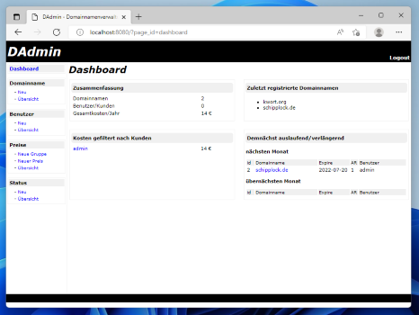
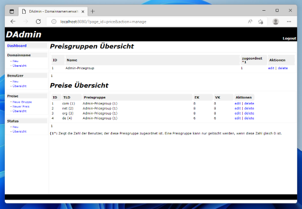

# DAdmin - Domain Administration

DAdmin ist eine Webanwendung zur Verwaltung von registrierten Domainnamen.
Es zeigt auslaufende Domainnamen an und schickt bei Bedarf einen Report via E-Mail.
Auch kann man mit DAdmin die Kosten verwalten und bei Bedarf pro Kunde auswerten.

## Screenshots

<p align="center">
<a href="dadmin/src/branch/main/screenshots/2022/dashboard.png"></a>
<a href="dadmin/src/branch/main/screenshots/2022/preisgruppe.png"></a>
</p>

## Hintergrund

Es handelt sich hierbei um mein **Abschlussprojekt aus 2009**. Für die Umsetzung
wurde Perl 5 (CGI, mod_perl2) und Postgresql 8 genutzt.
Das Projekt enthält Sicherheitslücken, u.a. SQL-Injections.
Die Benutzerauthentifizierung wurde selbst implementiert und nutzt weder Salts noch sichere Hashing-Algorithmen für das Passwort.
Ich würde das heute so nicht mehr programmieren, aber es hat sentimentalen Wert. Es war mein erstes richtiges Projekt.

Ein Großteil der Business-Logik befindet sich in der Datenbank (Stored Procedures u.a.).
Die Präsentationsschicht ist einfach gehalten.

## Installation

In 2022 habe ich eine Docker-Umgebung gebaut, damit man sich das Projekt mal
anschauen kann, wenn man denn unbedingt möchte.

**Docker Container bauen und hochfahren:**

```bash
docker-compose up -d dadmin-app && docker logs -f dadmin-app
```

**Im Webbrowser dann folgenden Link aufrufen:** http://localhost:8080 (Hier mit admin/admin anmelden)

Bevor man Domainnamen anlegen kann, muss man einen Status hinzufügen. Ich weiß
nicht mehr genau, wieso ich das für eine gute Idee hielt. Aus heutiger Sicht wirkt
es falsch, aber egal :).
